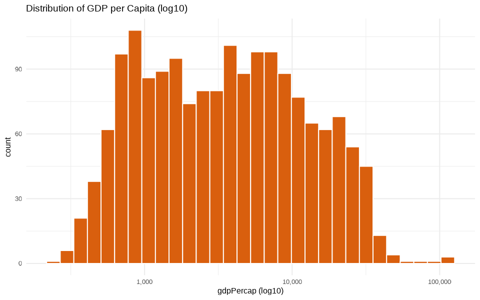
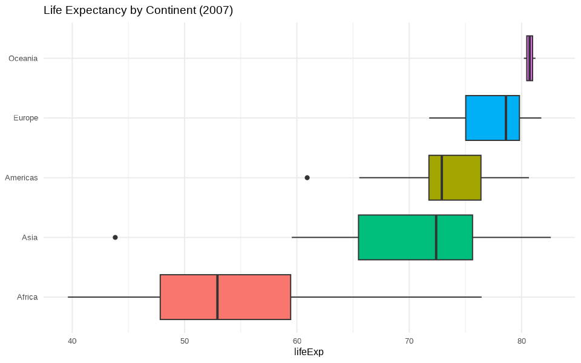
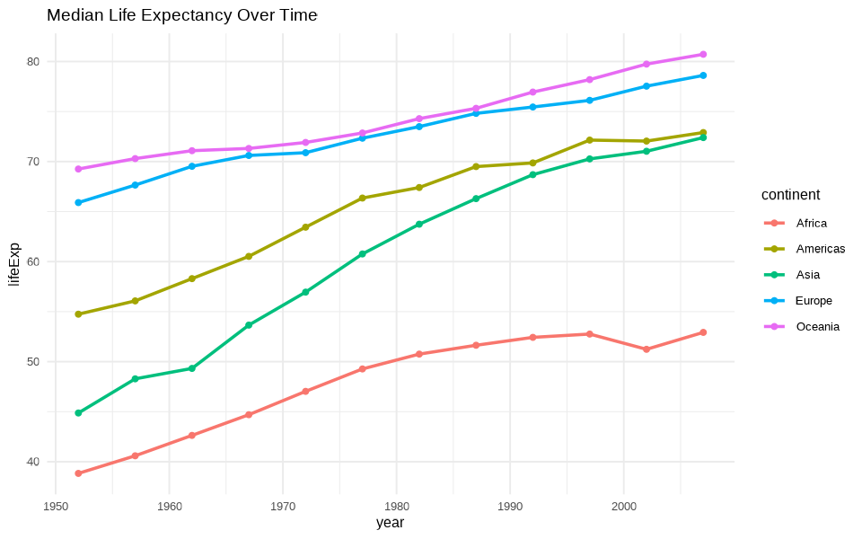
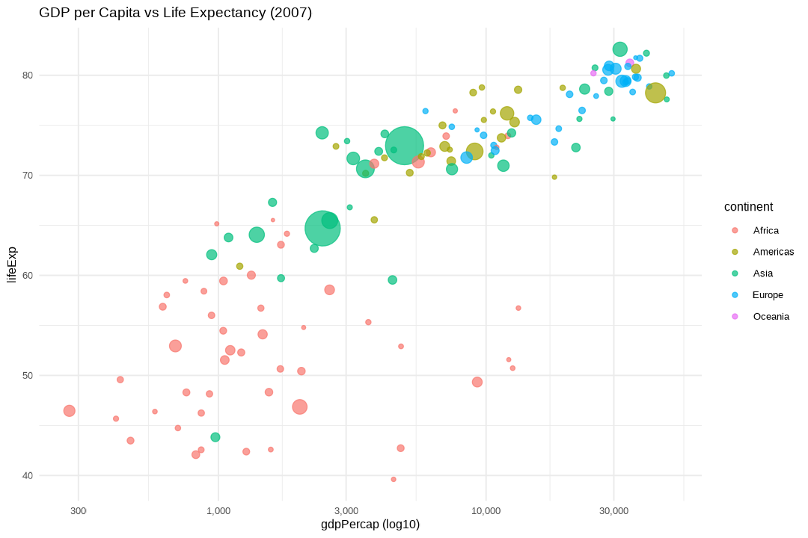

# gapminder 탐색적 데이터 분석(EDA) 보고서

- **대상 파일**: `data/gapminder.csv`
- **분석 스크립트**: `eda.R` (dplyr, tidyr, ggplot2, scales)
- **분석일**: 2026-06-27
- **데이터 범위**: 142개국 × 12시점(1952–2007, 5년 간격), 총 1,704 관측치
- **그래프**: `figures/` 폴더 (PNG 5종)

---

## 0. 개요

수치형 변수 요약:

| 변수 | Min | 1Q | Median | Mean | 3Q | Max |
|---|---|---|---|---|---|---|
| lifeExp | 23.60 | 48.20 | 60.71 | 59.47 | 70.85 | 82.60 |
| gdpPercap | 241.2 | 1,202.1 | 3,531.8 | 7,215.3 | 9,325.5 | 113,523.1 |
| pop | 60,011 | 2.79M | 7.02M | 29.60M | 19.59M | 1.32B |

---

## 1. 단변량 분포

**왜도(skewness)**

| 변수 | 왜도 | 해석 |
|---|---|---|
| lifeExp | −0.25 | 약한 좌편향, 대체로 대칭 |
| gdpPercap | +3.84 | 강한 우편향 → **log 변환 권장** |
| pop | +8.33 | 매우 강한 우편향 (중국·인도 등 거대국) |

> `gdpPercap`, `pop`은 원척도에서 극단적으로 치우쳐 있어 로그 척도에서 분석·시각화하는 것이 적합합니다.

---

## 2. 대륙별 비교 (2007년)

| continent | n | lifeExp 중앙값 | gdpPercap 중앙값 | 인구 합계 |
|---|---|---|---|---|
| Oceania | 2 | 80.72 | 29,810 | 24.5M |
| Europe | 30 | 78.61 | 28,054 | 586M |
| Americas | 25 | 72.90 | 8,948 | 899M |
| Asia | 33 | 72.40 | 4,471 | 3.81B |
| Africa | 52 | **52.93** | **1,452** | 930M |

> 아프리카의 기대수명 중앙값은 유럽 대비 약 **26년** 낮고, GDP 중앙값도 최하위입니다. 대륙 간 격차가 뚜렷합니다.

---

## 3. 시계열 추세 (대륙별 기대수명 중앙값)

| year | Africa | Americas | Asia | Europe | Oceania |
|---|---|---|---|---|---|
| 1952 | 38.83 | 54.75 | 44.87 | 65.90 | 69.26 |
| 1972 | 47.03 | 63.44 | 56.95 | 70.89 | 71.91 |
| 1987 | 51.64 | 69.50 | 66.30 | 74.82 | 75.32 |
| 2002 | 51.24 | 72.05 | 71.03 | 77.54 | 79.74 |
| 2007 | 52.93 | 72.90 | 72.40 | 78.61 | 80.72 |

> 모든 대륙이 우상향하지만 **아프리카는 1990년대에 정체·일시 하락**(1987년 51.6 → 2002년 51.2)했습니다. HIV/AIDS 확산과 분쟁의 영향으로 해석됩니다. 아시아는 가장 빠른 추격세를 보입니다.

---

## 4. GDP per Capita ↔ 기대수명

- **상관계수**: lifeExp ~ log10(gdpPercap) → **r = 0.808** (강한 양의 관계)

> gapminder의 대표적 패턴: 소득이 높을수록 기대수명이 높지만, 로그 척도에서 선형에 가까워 **저소득 구간에서의 소득 증가가 기대수명 향상에 더 크게 기여**함을 시사합니다(수확 체감). 버블 크기는 인구.

---

## 5. 극단값 (2007년)

**기대수명 상위 5개국**

| country | continent | lifeExp | gdpPercap |
|---|---|---|---|
| Japan | Asia | 82.60 | 31,656 |
| Hong Kong China | Asia | 82.21 | 39,725 |
| Iceland | Europe | 81.76 | 36,181 |
| Switzerland | Europe | 81.70 | 37,506 |
| Australia | Oceania | 81.24 | 34,435 |

**기대수명 하위 5개국**

| country | continent | lifeExp | gdpPercap |
|---|---|---|---|
| Swaziland | Africa | 39.61 | 4,513 |
| Mozambique | Africa | 42.08 | 824 |
| Zambia | Africa | 42.38 | 1,271 |
| Sierra Leone | Africa | 42.57 | 863 |
| Lesotho | Africa | 42.59 | 1,569 |

> 하위 5개국이 **모두 아프리카**. 스와질란드는 소득(4,513$)이 비교적 높음에도 기대수명이 최하위로, 소득만으로 설명되지 않는 보건 요인(HIV/AIDS)을 드러냅니다.

---

## 6. 기대수명 증가폭 (1952 → 2007)

**최대 증가 5개국**

| country | continent | 1952 | 2007 | 증가 |
|---|---|---|---|---|
| Oman | Asia | 37.58 | 75.64 | +38.06 |
| Vietnam | Asia | 40.41 | 74.25 | +33.84 |
| Indonesia | Asia | 37.47 | 70.65 | +33.18 |
| Saudi Arabia | Asia | 39.88 | 72.78 | +32.90 |
| Libya | Africa | 42.72 | 73.95 | +31.23 |

**최소 증가(역행) 5개국**

| country | continent | 1952 | 2007 | 증가 |
|---|---|---|---|---|
| Zimbabwe | Africa | 48.45 | 43.49 | **−4.96** |
| Swaziland | Africa | 41.41 | 39.61 | **−1.79** |
| Zambia | Africa | 42.04 | 42.38 | +0.35 |
| Lesotho | Africa | 42.14 | 42.59 | +0.45 |
| Botswana | Africa | 47.62 | 50.73 | +3.11 |

> 아시아 산유국·신흥국이 가장 큰 향상을 보인 반면, 짐바브웨·스와질란드는 **1952년보다 기대수명이 오히려 낮아진** 드문 역행 사례입니다.

---

## 종합 결론

1. **대륙 간 양극화**: 아프리카가 기대수명·소득 모두에서 뚜렷이 뒤처지며, 격차가 분석의 핵심 축.
2. **소득–수명 관계**: log 소득과 기대수명은 강한 양의 상관(r=0.81), 저소득 구간에서 수익 체감형.
3. **시간적 수렴과 예외**: 대부분 국가가 향상되며 격차가 좁혀지는 추세이나, HIV/AIDS·분쟁 피해국은 1990년대 이후 정체·역행.
4. **분석 함의**: `gdpPercap`·`pop`은 로그 변환 후 모델링하고, 대륙·연도를 핵심 설명/층화 변수로 사용하는 것이 적절.

> 재현: `Rscript eda.R` 실행 시 동일한 콘솔 요약과 `figures/`의 그래프 5종이 생성됩니다.
