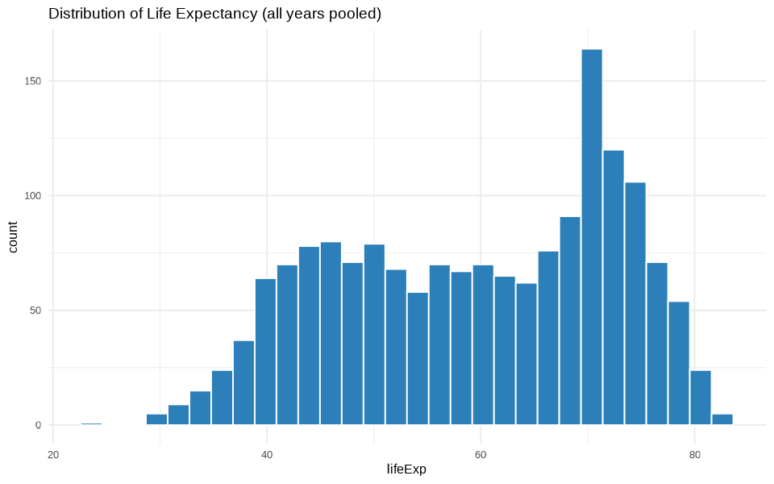
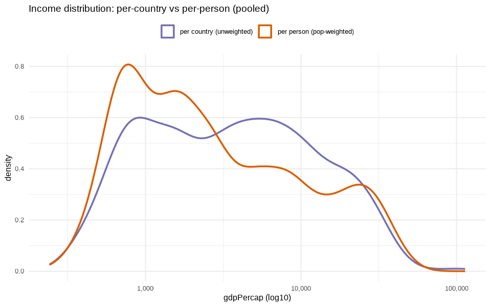
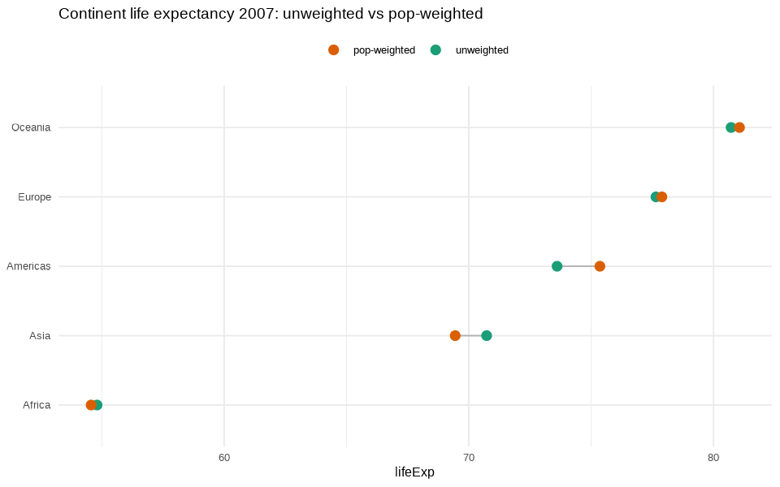
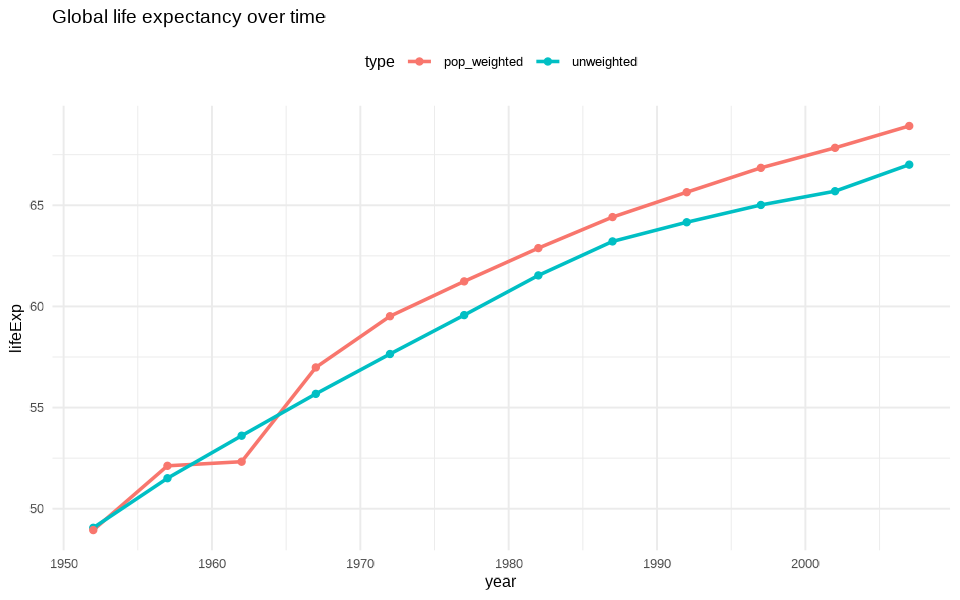
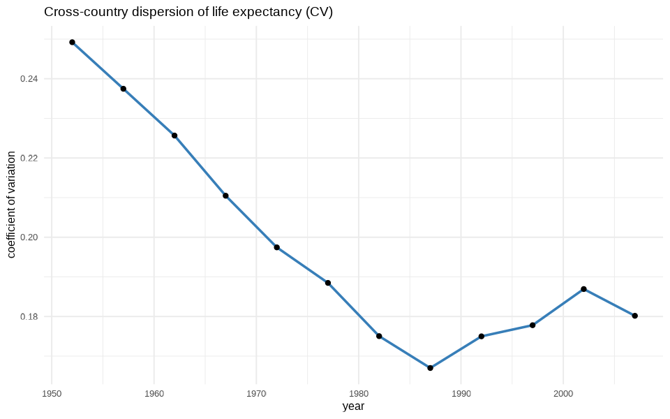
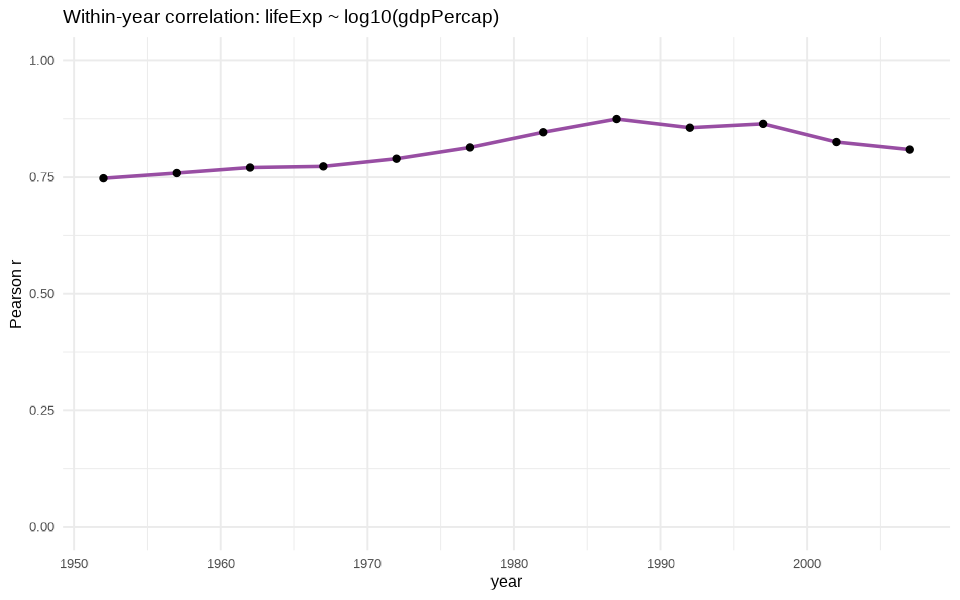
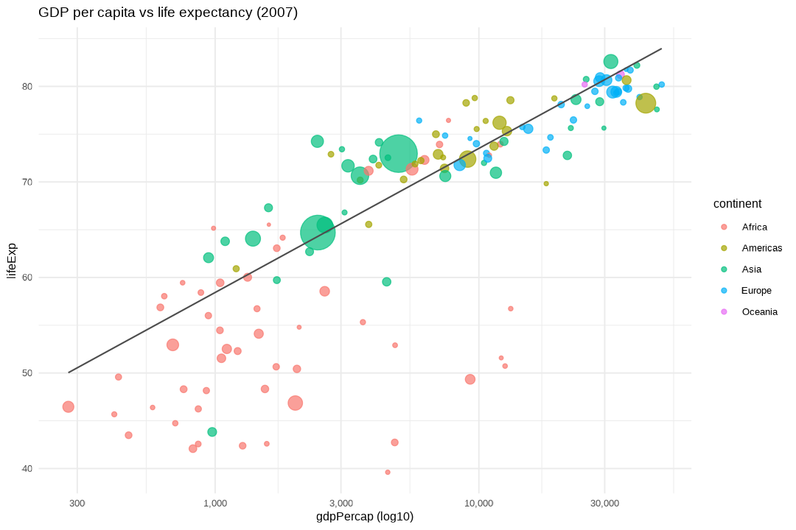

# gapminder 탐색적 데이터 분석(EDA) 보고서 — 개정판

- **대상 파일**: `data/gapminder.csv`
- **분석 스크립트**: `eda.R` (dplyr, tidyr, ggplot2, scales) — R 4.5.1
- **분석일**: 2026-06-27
- **데이터 범위**: 142개국 × 12시점(1952–2007, 5년 간격), 총 1,704 관측치
- **그래프**: `figures/` 폴더 (PNG 7종)

> **분석 원칙** — (1) 모든 수치는 `eda.R`이 출력한 값에 근거(암기·단정 금지), (2) **1국가=1표본(unweighted)**과 **1인=1표본(population-weighted)**을 구분, (3) EDA는 **패턴**을 보일 뿐 **인과를 규명하지 않음**(인과 해석은 잠정 표기).

---

## 데이터 한계 (해석 시 유의)

- 5년 간격·142개국만 포함된 **가공/보간 데이터**(원자료 아님).
- **Oceania는 호주·뉴질랜드 2개국뿐** → '대륙 요약'으로 일반화 불가, 참고용으로만 사용.

---

## 0. 개요

| 변수 | Min | Median | Mean | Max | 왜도 |
|---|---|---|---|---|---|
| lifeExp | 23.60 | 60.71 | 59.47 | 82.60 | −0.25 (대체로 대칭) |
| gdpPercap | 241.2 | 3,531.8 | 7,215.3 | 113,523.1 | +3.84 (강한 우편향) |
| pop | 60,011 | 7.02M | 29.60M | 1.32B | +8.33 (매우 강한 우편향) |

→ `gdpPercap`·`pop`은 로그 척도에서 분석.

---

## 1. 단변량 분포 및 이상치 (데이터로 검증)

최고 `gdpPercap` 관측치를 코드로 확인한 결과:

| country | year | pop | continent | lifeExp | gdpPercap |
|---|---|---|---|---|---|
| **Kuwait** | **1957** | 212,846 | Asia | 58.033 | **113,523.1** |

`gdpPercap` 상위 5건이 **전부 쿠웨이트(1952–1972)** — 초기 산유국 이상치로, 소득 분포의 오른쪽 꼬리를 지배. 산점도·상관 해석 시 유의.

**소득 분포: 1국가=1표본 vs 1인=1표본** — 인구가중 밀도는 비가중보다 왼쪽(저소득)으로 이동. 세계 "국가들"의 분포와 세계 "사람들"의 분포는 다름.

---

## 2. 인구 가중 vs 비가중 (핵심 보완) ⭐

기대수명을 **국가 평균**으로 볼지 **사람 1인 기준**으로 볼지에 따라 결론이 달라진다.

**2007년 대륙별 기대수명**

| continent | n | 비가중 | 인구가중 | 차이(Δ) |
|---|---|---|---|---|
| Oceania | 2 | 80.72 | 81.06 | +0.34 |
| Europe | 30 | 77.65 | 77.89 | +0.24 |
| Americas | 25 | 73.61 | 75.36 | **+1.75** |
| Asia | 33 | 70.73 | 69.44 | **−1.28** |
| Africa | 52 | 54.81 | 54.56 | −0.24 |

- **전세계**: 비가중 **67.01** vs 인구가중 **68.92** (**+1.91년**)
- **아시아**(Δ−1.28): 인구 큰 국가(인도 등)의 기대수명이 상대적으로 낮아 가중 시 하락.
- **아메리카**(Δ+1.75): 인구 많고 수명 긴 미국이 평균을 끌어올림.

> **함의**: 가중·비가중을 구분하지 않으면 헤드라인 수치가 1~2년씩 어긋난다. 이전 보고서의 모든 "대륙 중앙값"은 비가중이었음(= 인구 무시).

---

## 3. 전세계 기대수명 추세 (가중/비가중)

| year | 비가중 | 인구가중 |
|---|---|---|
| 1952 | 49.06 | 48.94 |
| 1972 | 57.65 | 59.51 |
| 1987 | 63.21 | 64.42 |
| 2002 | 65.69 | 67.84 |
| 2007 | 67.01 | 68.92 |

> 1960년대 이후 인구가중 수명이 비가중을 지속 상회 → 인구 많은 국가들의 개선이 (국가 수 기준 평균보다) 빨랐음을 시사.

---

## 4. 수렴(convergence) — 격차는 단조 축소가 아니다 ⭐

국가 간 기대수명 분산(변동계수 CV)의 시간 변화:

| year | sd | CV | IQR |
|---|---|---|---|
| 1952 | 12.23 | 0.2492 | 20.71 |
| 1977 | 11.23 | 0.1885 | 19.91 |
| **1987** | 10.56 | **0.1670** | 16.94 |
| **2002** | 12.28 | **0.1869** | 19.94 |
| 2007 | 12.07 | 0.1802 | 19.25 |

- 전체적으로 CV **0.2492(1952) → 0.1802(2007)** 감소 = 수렴 패턴.
- **그러나 단조롭지 않음**: 1987년 최저(0.167)까지 좁혀졌다가 **1987–2002 재확대(0.187)** 후 소폭 회복.

> "격차가 꾸준히 좁혀졌다"는 단순 서사는 데이터와 맞지 않음 — 1990년대~2000년대 초 **발산 구간**이 존재.

---

## 5. GDP ↔ 기대수명 — 풀링 상관의 함정 ⭐

| 측정 방식 | 상관 r |
|---|---|
| **풀링**(1952–2007 전체) | 0.808 ← 시간추세가 섞여 단면 해석에 부적절 |
| 연도별 단면 (범위) | 0.748 ~ 0.874 (평균 0.811) |

**연도별 단면 상관** (시점마다 다름):

| year | 1952 | 1972 | 1987 | 2002 | 2007 |
|---|---|---|---|---|---|
| r | 0.748 | 0.789 | **0.874** | 0.825 | 0.809 |

- 1987년 정점 후 완만히 하락.
- 2007년 단순회귀 `lifeExp ~ log10(gdpPercap)`: **R² = 0.654** (소득 로그가 수명 분산의 약 65% 설명).

> 소득과 수명은 강한 양의 관계지만, **풀링 r 하나로 요약하면 시간추세를 인과처럼 오해**할 수 있음. 단면은 매 시점 독립적으로 봐야 함.

---

## 6. 극단값 및 변화 — 패턴 기술(인과 단정 아님)

**2007년 상위 3 / 하위 3**

| 구분 | country | continent | lifeExp | gdpPercap |
|---|---|---|---|---|
| 상위 | Japan | Asia | 82.60 | 31,656 |
| 상위 | Hong Kong China | Asia | 82.21 | 39,725 |
| 상위 | Iceland | Europe | 81.76 | 36,181 |
| 하위 | Swaziland | Africa | 39.61 | 4,513 |
| 하위 | Mozambique | Africa | 42.08 | 824 |
| 하위 | Zambia | Africa | 42.38 | 1,271 |

**1952→2007 증가 상위 3**: Oman +38.06, Vietnam +33.84, Indonesia +33.18 (아시아).

**역행(감소) 사례**: Zimbabwe **−4.96**, Swaziland **−1.79**.

> ⚠️ **인과 주의**: 위 정체·역행은 **패턴**일 뿐이다. 원인(질병·분쟁 등)은 EDA로 규명할 수 없으며, 별도의 인과 검증(추가 자료·식별전략)이 필요하다. 이전 보고서의 "HIV/AIDS·수확체감" 단정은 본 개정판에서 제거함.

---

## 종합 결론

1. **가중 vs 비가중을 구분해야 한다** — 1인 기준 전세계 수명(68.9)은 국가평균(67.0)보다 1.9년 높고, 대륙별로 ±1~2년 차이. 모든 집계는 두 관점을 함께 제시.
2. **소득–수명은 강한 양의 단면 관계**(연도별 r≈0.75–0.87, 2007 R²=0.65)이나, 풀링 상관(0.808)은 시간추세 혼입으로 단면 해석에 부적절.
3. **수렴은 단조롭지 않다** — 장기적으로 격차 축소(CV 0.25→0.18)지만 1990년대 발산 구간 존재.
4. **이상치·소표본 유의** — 쿠웨이트(소득)·Oceania(n=2)는 일반화 금지.
5. **인과는 미규명** — 역행·정체 패턴의 원인은 EDA 범위 밖. 후속 검증 과제.

> **재현**: `Rscript eda.R` 실행 시 본 보고서의 모든 수치와 `figures/`의 그래프 7종이 생성됩니다. 모든 주장은 스크립트 출력에 1:1 대응합니다.
